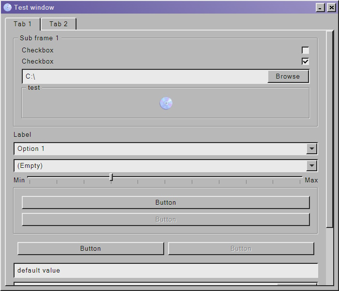

<h1>Reflection -UI</h1>



Reflection -UI is a c++20 desktop application library. It offers an c++ api to add visual elements to a window.
Internally it uses the WebView2 browser to renderer UI components. <br> <br>

> [!NOTE]
> This project is currently only supported on windows. WebView2 is not cross-platform. <br>
> Feel free to open a pr with a different browser framework implementation

<h2>How to compile from source</h2>
The project will run some typescript code which and <a href="https://bun.sh/">BUN</a> as its interpreter. <br>
To keep this repository small the dependencies have not been shipped but will be explained here:
<h3>JSON</h3>
For JSON parsing <a href="https://github.com/nlohmann/json">nlohmann json</a>. <br>
place the contents of the single_include in the include folder of the json dependency
<h3>WebView2</h3>
In the include folder place <code>WebView2.h</code> & <code>WebView2EnvironmentOptions.h</code>. <br>
In the lib folder place <code>WebView2LoaderStatic.lib</code>
<h3>wil</h3>
Copy the wil folder direcly into the include folder of the wil dependency.

<h2>How to compile when included</h2>
Just link the .lib of either the debug or release depending on your target and link the header files that come included, no extra libraries needed.

<h2>CMake using MSVC</h2>

```powershell
PS> mkdir build
PS> cd build
PS> cmake .. -G "Visual Studio 17 2022" -A x64
PS> cmake --build . --config Release
```

<h2>Documentation & Examples</h2>
For an example program please look <a href="./src/example/">here</a>